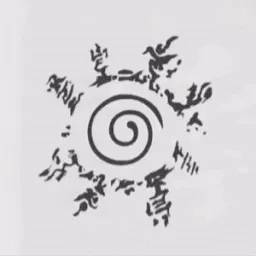

<h1 align="center">Mine-Naruto Launcher</h1>

<em><h5 align="center">(formerly Electron Launcher)</h5></em>

---

---

You can download from [GitHub Releases](https://github.com/Poulpinounette/Mine-NarutoLaucher/releases)

#### Latest Release

#### Latest Pre-Release

**Supported Platforms**

If you download from the [Releases](https://github.com/Poulpinounette/Mine-NarutoLaucher/releases) tab, select the installer for your system.

| Platform    | File                                     |
| ----------- | ---------------------------------------- |
| Windows x64 | `Helios-Launcher-setup-VERSION.exe`      |
| macOS       | `Helios-Launcher-setup-VERSION.dmg`      |
| Linux x64   | `Helios-Launcher-setup-VERSION.AppImage` |

---

### Based on HeliosLaucher. Thanks Daniel Scalzi for your work.

feel free to look HeliosLaucher : https://github.com/dscalzi/HeliosLauncher
